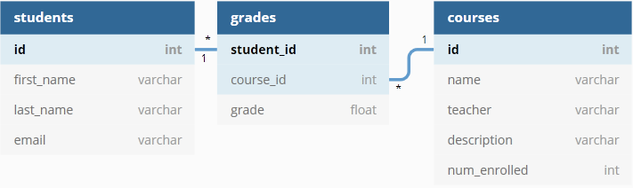

# Otus Tech Challenge

## Demo App

I have deployed the front end of my project to [Firebase](https://botus-middle-school.web.app/ "Botus Middle School Frontend").

The base URL routes to the `/students` end-point which contains a table of all the students in the database which is searchable by any combination of first name and last name.

Each entry in the `/students` table is a link to the `student/:id` end-point which contains full details for that student including first name, last name, email address, cumulative GPA, and a report card for their enrolled classes.

## Data Modeling

My [SQL database schema](https://dbdiagram.io/d/5e3b3e049e76504e0ef1166e "dbdiagram Otus-db") has 3 tables: students, grades, and courses. The diagram shows the relationships between the tables.

(note: **bold** indicates primary key)

Example validations on data:

* Student table, ensuring:
  * email addresses contain exactly one `@` character and include `.co` or `.com`.
  * email addresses are unique.
  * student records are unique (`full_name` and `course_id` + `grade` do not contain duplicates).
  * `CHECK()` on `string` and `varchar` fields only contain alphanumeric characters.
* Grade table, ensuring:
  * `grade` value in range 0-4.
  * no duplicate concatenations of `student_id` and `course_id` (one record per student per course).
* Courses table, ensuring:
  * `num_enrolled` value for any class does not exceed total numer of students.
  * `CHECK()` that only alphanumeric characters and punctuation exist in the `teacher` and `description` columns.
